<h2><code>ADITYA KUMAR SINGH</code></h2>

<code>AI Engineer • Full Stack Developer • Researcher</code>

<h3><code>aditya@github ~ $ ./contributions.sh</code></h3>

  

<h3><code>aditya@github ~ $ whoami</code></h3>
<table>
  <tr>
    <td valign="top"></td>
    <td valign="top"></td>
  </tr>
</table>

<h3><code>aditya@github ~ $ ls projects</code></h3>
<code>
&gt; UniSafe 
&gt; LumiBin 
&gt; Parking Detection 
&gt; AI Avatar 
&gt; RAG Debate Generator
</code>

  

<h3><code>aditya@github ~ $ status</code></h3>
<code>🟢 Building AI Products...</code>

